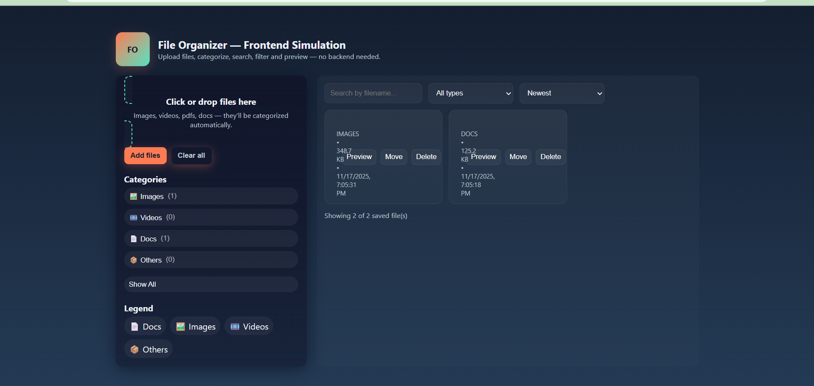
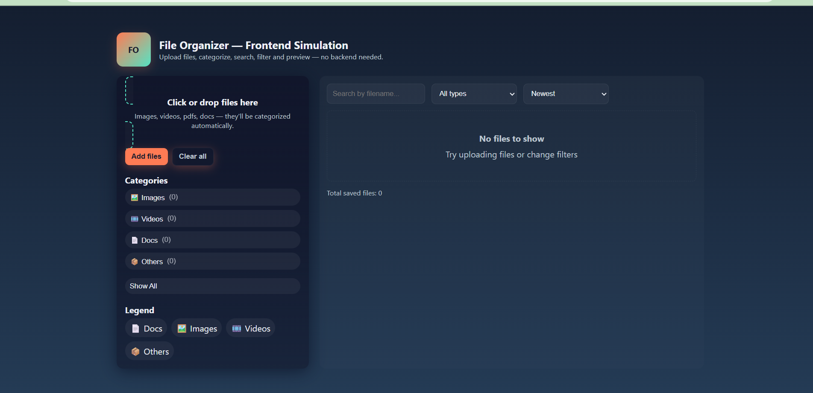

# file-organizer-frontend
File Organizer — Frontend Simulation is a lightweight and user-friendly web application designed to simulate organizing files on the client side using only HTML, CSS, and JavaScript. The project provides an interactive experience where users can upload files, categorize them automatically, preview images, filter by type.
✨ Features

Drag & Drop Upload: Upload files by dragging them into the dropzone or using the file picker.

Automatic Categorization: Files are automatically categorized as:

Images (🖼️)

Videos (🎞️)

Documents (📄)

Others (📦)

Search & Filter: Search files by name or filter by type/category.

Sorting Options: Sort files by newest, oldest, or alphabetical order (A→Z, Z→A).

File Preview: Preview images directly in a modal. For other files, view file details like name, type, size, and date added.

File Management: Delete files or move them to a different category manually.

Persistent Storage: Files metadata and thumbnails are saved in the browser’s localStorage so they remain even after refreshing the page.

Responsive Design: Works seamlessly on both desktop and mobile devices.

Keyboard & Clipboard Support: Paste images directly using Ctrl+V.

📦 Expected Output / Screenshots

Homepage: A clean interface with a header, sidebar (file upload + categories), and main area showing uploaded files.

File Cards: Each file is displayed as a card with thumbnail/icon, file name, category, size, date, and action buttons (Preview, Move, Delete).

Category Chips: Display counts for each category; clicking a chip filters files dynamically.

Empty State: When no files are uploaded, a friendly message encourages users to add files.

🚀 How to Run

Clone or download the repository:

>>>git clone https://github.com/Rutika72/file-organizer-frontend.git

Open index.html in your browser.

Start uploading and organizing your files immediately.

Preview Modal: Clicking preview opens a modal with a larger image and file details.

(You can add screenshots here in your README for better visual reference.)

OUTPUT:-

